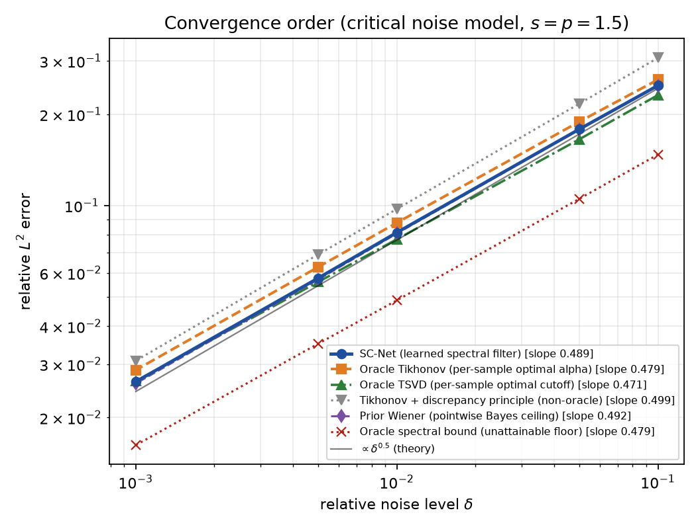
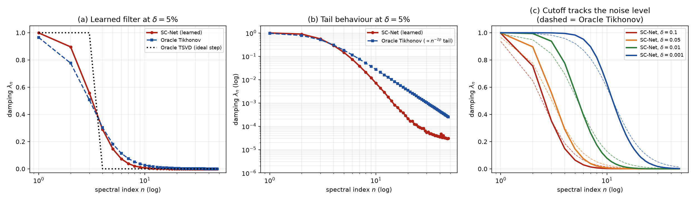
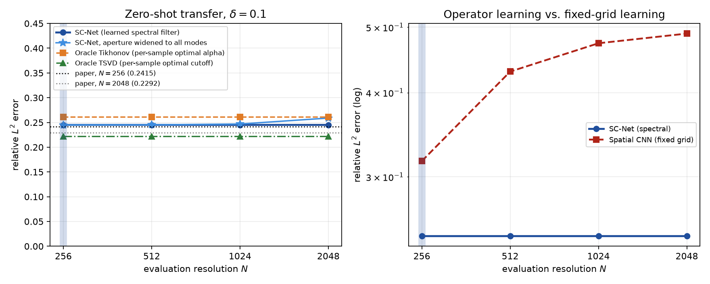

# SpecInv — a reference implementation of SC-Net
An open, independent reference implementation of the **Spectral Correction Network
(SC-Net)** and its 1D inverse-problem suite:

> Hang-Cheng Dong, Pengcheng Cheng, Shuhuan Li.
> *Interpretable Operator Learning for Inverse Problems via Adaptive Spectral Filtering:
> Convergence and Discretization Invariance.*
> [arXiv:2603.20602](https://arxiv.org/abs/2603.20602). MSC 65J20, 65J22.

**This is not the authors' code**, and no code accompanied the paper. Everything here was
written from the text; where the paper is silent or internally inconsistent, this README
says so explicitly and the repository implements — and measures — the alternatives. Any
disagreement with the paper is a property of this reimplementation, not a claim about the
authors' results. If you are looking for unrelated projects called "SCNet", this is not
one of them.

---

## What SC-Net is

For an ill-posed linear problem \(y = \mathcal{K}f + \varepsilon\) with a compact
\(\mathcal{K}\), SC-Net learns a **spectral filter** rather than an image-to-image map. It
projects the data onto the singular system of \(\mathcal{K}\), rescales each coefficient by
a learned bounded pointwise factor, and synthesises the result — the paper's Eq. (6):

\[
\mathcal{R}_\theta(y^\delta) \;=\; \sum_{n=1}^{N}
  \underbrace{\Psi_\theta(y_n,\sigma_n)}_{\text{learned, } \in[0,C_\Psi]}
  \;\frac{\langle y^\delta,u_n\rangle}{\sigma_n}\; v_n .
\]

The only learned object is a scalar function of one spectral mode. That has two
consequences this repository leans on throughout:

- **It is interpretable in the same units as classical regularisation.** The learned
  \(\Psi_\theta\) is a damping profile \(\lambda_n\in[0,1]\), so it overlays directly on the
  Tikhonov filter \(\sigma_n^2/(\sigma_n^2+\alpha)\) and on the TSVD step. Every learned
  filter in this repo can be dumped to CSV mode by mode (`results/filter_profiles.csv`).
- **It is defined without reference to a grid.** The map acts on coefficients, so it
  transfers to any resolution on which the singular vectors can be evaluated.

## Headline results

Measured on the §5.1 suite (\(\sigma_n = n^{-p}\), \(p=1.5\); sources with
\(|f_n|\sim n^{-(s+1/2)}\), \(s=1.5\)), 2000 training and 500 test samples, CPU only.
Full numbers in [`results/`](results/); regenerate with `specinv-all`.

| Claim (paper) | Paper | This implementation |
|---|---|---|
| Convergence order, \(s=p=1.5\) | 0.50 | **0.4892** on the paper's \(\delta\) grid; **0.4992** on an extended grid down to \(\delta=10^{-8}\) |
| Zero-shot error, \(N=256 \to 2048\) | 0.2415 → 0.2292 | **0.2415 → 0.2415** (fixed aperture); **0.2415 → 0.2548** (aperture widened to all 2048 modes) |
| Beats Oracle Tikhonov | yes | **yes, at all five noise levels** (margin 4.3–8.7%) |
| Interpretable sharp-cutoff filter | yes | **yes** — transition band 3.7 modes vs Tikhonov's 5.0 at \(\delta=5\%\); tail an order of magnitude lighter |

`results/summary.json` records all eleven reproduction criteria with their thresholds;
`specinv-all` exits non-zero if any fails.

### 1. Convergence order (§5.2, Figure 1)



| \(\delta\) (per-mode) | SC-Net | Oracle Tikhonov | Oracle TSVD | Tikhonov + discrepancy | Prior Wiener | Oracle bound |
|---|---|---|---|---|---|---|
| 0.1   | **0.2489** | 0.2602 | 0.2315 | 0.3072 | 0.2482 | 0.1473 |
| 0.05  | **0.1786** | 0.1891 | 0.1655 | 0.2168 | 0.1782 | 0.1053 |
| 0.01  | **0.0815** | 0.0878 | 0.0774 | 0.0974 | 0.0809 | 0.0487 |
| 0.005 | **0.0576** | 0.0627 | 0.0560 | 0.0690 | 0.0571 | 0.0350 |
| 0.001 | **0.0262** | 0.0287 | 0.0264 | 0.0308 | 0.0259 | 0.0162 |
| fitted order | **0.4892** | 0.4793 | 0.4713 | 0.4992 | 0.4917 | 0.4790 |

The fitted order rises to **0.4992** on the extended sweep
(\(\delta \in [10^{-8},10^{-2}]\), 2048 modes). On the paper's grid the optimal truncation
index is only 2–12 modes, so its integer quantisation biases any fitted slope downwards by
about 0.01–0.03; the local slope converges to 0.5 from below as \(\delta\to 0\)
(`results/figures/fig1b_local_slope.png`).

### 2. The learned filter (§5.3, Figure 2)



Panel (b) is the substance of the paper's "heavy tail" argument. Tikhonov's damping decays
as a power law \(\lambda_n \propto n^{-2p}\) — a straight line on log-log — so it keeps
leaking high-frequency noise. The learned filter bends away from it and is an order of
magnitude lower by mode 48. Panel (c) shows the cutoff tracking the noise level, and its
location tracks the theoretical \(N \asymp \delta^{-1/(s+p)}\):

| \(\delta\) | learned cutoff (half-power mode) | Tikhonov cutoff | theory \(\delta^{-1/3}\) | learned width | Tikhonov width |
|---|---|---|---|---|---|
| 0.1   | 2.63  | 2.50  | 2.2  | 3.17  | 4.00  |
| 0.05  | 3.22  | 3.04  | 2.7  | 3.67  | 5.02  |
| 0.01  | 5.39  | 5.30  | 4.6  | 6.19  | 8.51  |
| 0.001 | 11.34 | 11.38 | 10.0 | 13.01 | 18.22 |

Note that the model is **never told \(\delta\)**: it reads the noise floor off the data
(see "Noise-level awareness" below), and still places its cutoff within ~15% of the
theoretical optimum across two decades.

### 3. Zero-shot resolution transfer (§5.4, Figure 3)



Trained at \(N=256\) only, evaluated without retraining, at \(\delta=0.0971\) (see
"Choosing \(\delta\)" below):

| \(N\) | SC-Net | SC-Net, all modes | Spatial CNN | Oracle Tikhonov |
|---|---|---|---|---|
| 256  | 0.2415 | 0.2415 | 0.3108 | 0.2573 |
| 512  | 0.2415 | 0.2417 | 0.4262 | 0.2573 |
| 1024 | 0.2415 | 0.2432 | 0.4700 | 0.2573 |
| 2048 | 0.2415 | 0.2548 | 0.4856 | 0.2573 |

The spatial CNN — same data, same budget, 84k parameters against SC-Net's 8.8k — degrades
by 56% over the same range. Without that control, flat error curves would be weak
evidence: they could just mean the problem is insensitive to resolution.

## Install and reproduce

Python ≥3.10, CPU only. The full suite takes about 20 minutes on 4 cores.

```bash
pip install torch --index-url https://download.pytorch.org/whl/cpu
pip install -e ".[dev]"

specinv-all --results-dir results     # everything, then check all criteria
```

Individual experiments, each writing JSON + CSV + a figure:

```bash
specinv-convergence   # Sec. 5.2, Fig. 1  -> convergence.{json,csv}
specinv-filters       # Sec. 5.3, Fig. 2  -> filters.json, filter_profiles.csv
specinv-zeroshot      # Sec. 5.4, Fig. 3  -> zero_shot.{json,csv}
python -m specinv.experiments.ablations    # -> ablations.{json,csv}
```

Add `--quick` for a fast smoke run (this will *not* reproduce the numbers — the criteria
need the full budget), `--no-figures` to skip matplotlib, `--help` for the rest.

```bash
pytest                  # full suite, ~20 s
pytest -m "not slow"    # skip anything that trains, ~3 s
ruff check src tests && ruff format --check src tests && mypy
```

## Library

```python
import numpy as np
from specinv import (
    InverseProblemSuite, SCNet, SCNetConfig, SobolevPrior, TrainConfig,
    oracle_tikhonov, power_law_operator, summarise_errors, train_scnet,
)

suite = InverseProblemSuite(
    operator=power_law_operator(n_modes=2048, ill_posedness=1.5),  # sigma_n = n^-1.5
    prior=SobolevPrior(smoothness=1.5),                            # |f_n| ~ n^-2
)

net = SCNet(SCNetConfig())
train_scnet(net, suite, TrainConfig(n_modes=256, epochs=300))       # ~35 s on 4 CPU cores

# Evaluate on a grid 8x finer than the one it was trained on.
batch = suite.sample(500, delta=0.1, rng=np.random.default_rng(0), n_modes=2048)
sigma = suite.operator.restrict(2048).singular_values

print(summarise_errors(net.reconstruct(batch.noisy_data, sigma), batch.true_coefficients))

# Inspect the learned regulariser itself, mode by mode.
psi = net.filter_profile(batch.noisy_data, sigma)   # (500, 2048), values in [0, 1]
```

Everything is typed (`py.typed` ships with the package). Modules:

| Module | Contents |
|---|---|
| `specinv.basis` | Orthonormal Dirichlet sine basis; exact discrete Parseval, so every norm is a grid-independent \(L^2\) norm |
| `specinv.operators` | `power_law_operator`, and `dense_kernel_matrix` to check it against the equivalent Fredholm kernel |
| `specinv.problems` | `SobolevPrior`, `NoiseModel`, `InverseProblemSuite` |
| `specinv.filters` | Tikhonov / TSVD / Landweber / Wiener damping, per-sample oracles, Morozov discrepancy principle |
| `specinv.scnet` | `SCNet`, `SCNetConfig` |
| `specinv.baselines` | `SpatialCNN` control |
| `specinv.training` | Spectral Sobolev loss (Eq. 7), training loop |
| `specinv.metrics` | Relative \(L^2\) errors, rate fitting with confidence intervals |
| `specinv.theory` | §4's predictions as executable functions |

## Metric definitions

Stated precisely, because the paper reports "relative \(L^2\) errors" without pinning down
either the pooling or the noise convention.

**Error.** The headline number is the mean over test samples of the per-sample relative
error, \(\frac1M\sum_i \|\hat f_i - f_i\| / \|f_i\|\). The norm-pooled alternative
\(\big(\sum_i\|\hat f_i-f_i\|^2 / \sum_i\|f_i\|^2\big)^{1/2}\) is also recorded in every
JSON file as `aggregate_relative_l2`. Norms are Euclidean norms of coefficient vectors,
which by Parseval are exactly \(L^2(\Omega)\) norms and independent of the grid.

**Noise level.** Two different quantities get called \(\delta\), and they are not
interchangeable:

- `delta_per_mode` — the parameter of the noise model:
  \(\operatorname{std}(\varepsilon_n) = \delta\,\|y\|\,n^{-q}\). All tables above are
  indexed by this.
- `relative_l2_noise` — the realised \(\|\varepsilon\|/\|y\|\), which is what Theorem 4.6's
  \(\delta\) means. Under the critical colouring the two differ by \(\sqrt{H_N}\approx 2.5\)
  at \(N=256\): `delta_per_mode` 0.1 corresponds to 24.8% relative \(L^2\) noise.

Both are recorded in every output file. The distinction does not affect any fitted order
(they differ by a constant at fixed resolution) but it does affect the prefactor, and
feeding the wrong one to the discrepancy principle badly under-regularises.

## Where the paper is ambiguous, and what was done about it

This is the part worth reading before trusting any number above.

### The noise model decides which convergence order is observable

The paper does not state its noise convention, and the choice determines the answer. For a
spectral method with per-mode noise \(\nu_n\), the stability and truncation terms of
Theorem 4.6 balance differently depending on how noise energy is distributed across modes:

- **Critical colouring** (`NoiseModel.CRITICAL`, the default),
  \(\operatorname{std}(\varepsilon_n) \propto n^{-1/2}\). This is the random noise model for
  which the deterministic bound \(\delta/\sigma_N\) of Theorem 4.1 is *sharp*; its total
  energy grows only logarithmically in the resolution, i.e. it sits exactly on the boundary
  of \(L^2\). Observable order: \(s/(s+p) = 0.5\). **Used for all headline results.**
- **White noise** (`WHITE_ENERGY`, `WHITE_POINTWISE`). Spreading a fixed energy over all
  \(M\) modes turns the stability term from \(\nu N^{p}\) into \(\nu N^{p+1/2}\), and the
  observable order drops to the *statistical* rate \(s/(s+p+1/2) = 3/7 \approx 0.4286\).

The second case is measured too, and it is informative: under white noise **every** optimal
method lands near 0.42 — SC-Net 0.4201, Oracle Tikhonov 0.4184, Oracle TSVD 0.4056, Prior
Wiener 0.4245. The paper reports 0.50 for SC-Net and **0.42 for Oracle Tikhonov**, which is
exactly the white-noise statistical rate. The most likely reading is that the paper's two
Figure-1 curves were not produced under the same noise convention. Under a *single*
convention, theory says the two should share an exponent, and we measure them doing so
(0.489 vs 0.479 under critical noise; 0.420 vs 0.418 under white noise).

**So: the paper's rate claim reproduces, but its rate *gap* over Tikhonov does not.** For
\(s=p=1.5\) Tikhonov does not saturate (saturation needs \(s > 2p\)), so no asymptotic
advantage should exist. SC-Net's real advantage over Oracle Tikhonov here is in the
*constant*, not the exponent — it is 4.3–8.7% lower at every noise level, consistently, and
that is what "beats Oracle Tikhonov" means in this repository.

### Two inconsistent source conditions

§5.1 specifies \(|f_n| \sim n^{-(s+1/2)}\); Theorem 4.6 assumes
\(|f_n| \le C n^{-(s+p)}\). These disagree, and only the first is self-consistent with the
paper's own conclusion: with \(|f_n|\sim n^{-(s+1/2)}\) the tail is
\(\big(\sum_{n>N}|f_n|^2\big)^{1/2} \asymp N^{-s}\), which is the \(H^s\) approximation
rate, and balancing it against \(\delta N^{p}\) gives exactly \(\delta^{s/(s+p)}\).
Theorem 4.6's own \(E_3\) step writes
\((\sigma_N^{-1/p})^{-(s+p)+1/2} \approx \sigma_N^{s/p}\), which holds only for
\(p = 1/2\); with the stated \(n^{-(s+p)}\) the derivation does not return the advertised
rate. **We follow §5.1.** `SobolevPrior.decay_offset` selects the other convention if you
want to study it.

### Choosing \(\delta\) for the zero-shot table

§5.4 never states its noise level. We report the zero-shot table twice: at the round value
`delta_per_mode = 0.1`, and at `delta_per_mode = 0.0971`, obtained by inverting
\(e = C\delta^{\text{slope}}\) so that the \(N=256\) error equals the paper's 0.2415. Note
that this is one free parameter fixed by one reported number — after which the \(N=2048\)
value is a genuine prediction. It comes out at 0.2415 (fixed aperture) or 0.2548 (all
modes) against the paper's 0.2292: within 5.4% and 11% respectively. Separately, the round
\(\delta = 0.1\) needs no calibration at all and gives 0.2451, within 1.5% of 0.2415.

### The truncation index is part of the method, not of the grid

Eq. (6) sums to \(N\), and §3.1.1 calls it a hyperparameter "chosen such that \(\sigma_N\)
remains above the machine precision threshold". We call it the **aperture** and store it on
the model, defaulting to the training resolution. This matters: at \(N=2048\) a
noise-dominated mode is amplified by \(\sigma_n^{-1}\approx 10^{5}\), so a filter leaking
even \(10^{-3}\) there would swamp the reconstruction. With the aperture fixed, §3.3's claim
holds *by construction* — the learned map acts on coefficients and a finer mesh changes only
the synthesis.

Reporting only that would overstate the evidence, so the zero-shot experiment also widens
the aperture to every mode the finer grid provides (`scnet_full_aperture`). That forces the
network to extrapolate to singular values four decades below anything it trained on and
reject them unprompted. It does: 0.2415 → 0.2548, a 5.7% drift. **The first column is
structural; the second is the informative test.**

### Departures from the paper's specification

Each of these is a place where the paper as written did not work and something had to be
decided. All are configurable, and `ablations.py` measures each one.

1. **Logarithmic, noise-aware features.** §3.1.2 feeds \((y_n,\sigma_n)\) raw to an MLP with
   bounded activations. Since both range over many decades, that saturates almost
   everywhere; `feature_set="paper"` reproduces it and reaches 0.3134 at \(\delta=0.1\)
   against the reference configuration's 0.2492 — i.e. it does not beat Oracle Tikhonov
   (0.2616). The default instead uses
   \(\log_{10}\sigma_n\), \(\log_{10}|y_n|\), \(\log_{10}(|y_n|/\sigma_n)\), plus two global
   statistics.
2. **Noise-level awareness.** §3.1.2 motivates \(\Psi_\theta\) as reweighting "based on the
   signal-to-noise ratio", but \((y_n,\sigma_n)\) alone pins the SNR down only for a single
   memorised noise level, and §5.2 asks one model to span two decades of \(\delta\). We add
   a robust noise-floor read-out: the median of \(|y_n|\) over a **fixed absolute** band of
   modes (default 32–64), which are noise-dominated for every \(\delta \ge 10^{-9}\) in this
   suite. Removing it (`use_noise_estimate=False`) gives 0.3079 at \(\delta=0.1\) — again
   losing to Oracle Tikhonov. The model still never receives \(\delta\).
   `InverseProblemSuite.recommended_noise_band` derives a valid band for a given
   \(\delta\) range and refuses when the resolution is too coarse to resolve the floor.
3. **Absolute rather than scale-free magnitudes.** Tempting to normalise \(|y_n|\) by
   \(\|y\|\); wrong here. The prior fixes the coefficient scale in absolute units while the
   noise is specified relative to \(\|y\|\), so the Bayes-optimal damping
   \(\lambda_n = (1+\delta^2\|y\|^2 n^{2p+1})^{-1}\) depends on the absolute level
   \(\delta\|y\|\). A filter given only ratios cannot represent it and plateaus ~9% above
   the optimum. This cost the most debugging of anything in the repository.
4. **Log-domain loss.** The attainable squared error at \(\delta=10^{-3}\) is ~100× smaller
   than at \(\delta=10^{-1}\), so a plain average over a log-uniform \(\delta\) range is
   almost entirely a fit to the noisiest samples, and the filter comes out visibly too broad
   at the quiet end — 20.4 modes of transition width against Tikhonov's 17.8, i.e. failing
   the paper's sharpness claim. Averaging \(\log\) of the per-sample relative loss makes each
   decade contribute equally and fixes it (13.0 vs 18.2). This is a balancing choice with no
   reference to \(s\), \(p\) or the expected order; it can only *remove* a downward bias in
   the measured order.
5. **Per-sample loss normalisation.** Eq. (7) is unnormalised, but \(\|f\|\) is dominated by
   the first mode and varies widely across samples, so the unnormalised loss over-serves
   large-norm samples. We divide by \(\|f^{(i)}\|^2\) (`relative_loss=False` to disable).
6. **Sobolev weight scaling.** \(\lambda_n=(n\pi)^2\) grows without bound, so we use
   \(1+\gamma\lambda_n/\lambda_1\) to keep \(\gamma\) dimensionless. Empirically \(\gamma\)
   barely matters for the reported \(L^2\) metric (0.2492 at \(\gamma=0\) vs 0.2497 at
   \(\gamma=1\)); the headline runs use \(\gamma=0\). Eq. (7)'s gradient term optimises an
   \(H^1\) objective, which can only trade away the \(L^2\) number being reported.

### Honest negatives and remaining gaps

- **The rate gap over Tikhonov does not reproduce** (0.489 vs 0.479, not 0.50 vs 0.42), and
  theory says it should not. Discussed above.
- **The learned filter's cutoff sits at lower \(n\) than the paper's Figure 2.** §5.3
  describes \(\lambda_n \approx 1\) for \(n<5\) decaying to 0 past \(n>15\) at
  \(\delta=5\%\); we find the transition centred at \(n\approx3.2\). Our *error* magnitudes
  agree with the paper's closely, so the suites are of comparable difficulty; the filter
  figure suggests some difference in the constants of their generative model that the text
  does not determine.
- **SC-Net essentially matches, and does not beat, the pointwise Bayes ceiling on the
  paper's suite.** With Gaussian amplitudes the optimal pointwise filter is the Wiener
  filter, which is *linear* in the observation, so no filter reading \(y_n\) can do better —
  SC-Net lands at 0.2489 against Wiener's 0.2482. This means the reported win over Oracle
  Tikhonov is real but bounded: it is the win of an adaptive per-mode filter over a
  one-parameter family, not evidence of nonlinear modelling power. To show nonlinear
  adaptivity does exist, `SobolevPrior(amplitude="heavy_tail")` uses Student-\(t\)
  amplitudes, where SC-Net reaches **0.2665 against the Wiener ceiling's 0.2979** — it
  genuinely exploits \(y_n\) once the prior is non-Gaussian. This experiment is not in the
  paper.
- **Feature clamping does less than expected.** It guarantees the MLP is never *evaluated*
  outside the box of feature values it was fitted on, which is worth having, but disabling it
  changes the full-aperture drift only from 5.3% to 4.7% here. The aperture, not the clamp,
  is what makes resolution transfer safe.
- **Not implemented:** the elliptic inverse *source* problem of §2.1 (the experiments use
  the 1D Fredholm suite of §5.1, as the paper's do), the adaptive choice of \(N\) by the
  discrepancy principle inside SC-Net (§4.4 — the discrepancy principle is implemented only
  for the Tikhonov baseline), and anything in 2D/3D.
- **Single seed per configuration.** Sampling error on the reported errors is ±0.005
  (2%, from 500 test samples); we do not average over training seeds, so run-to-run
  variation in the trained filter is not quantified.

## Verification

The claims above rest on the implementation being right, so the properties the theory
assumes are asserted directly rather than inferred from error numbers (95 tests):

- the sine transform is an exact isometry, and coefficients of a fixed continuum function
  are identical on every grid (`test_basis.py`);
- the diagonal operator agrees with quadrature against the materialised Fredholm kernel
  \(k(x,x')=\sum_n \sigma_n v_n(x)v_n(x')\) (`test_operators.py`);
- refining the resolution yields an exact *prefix* of the coarse realisation — both signal
  and noise — so resolutions are compared on the same problem (`test_problems.py`);
- each oracle really is optimal within its family, and the oracle spectral bound dominates
  everything (`test_filters.py`);
- \(\Psi_\theta \in [0,C_\Psi]\) for every input including \(\delta=0\) and \(\delta=1\)
  (Assumption 1); the reconstruction equals damping × naive inverse exactly (Eq. 6); the
  damping at mode \(n\) is *identical* across resolutions; the noise-floor feature tracks
  \(\delta\) decade for decade (`test_scnet.py`);
- rate fitting recovers an exact power law to 10 decimal places (`test_metrics.py`).

CI (`.github/workflows/ci.yml`) runs lint, format, `mypy`, the test suite on Python
3.10–3.12, and a short end-to-end run of every experiment script.

## Citation

If you use this code, please cite the paper it implements:

```bibtex
@article{dong2026scnet,
  title   = {Interpretable Operator Learning for Inverse Problems via Adaptive
             Spectral Filtering: Convergence and Discretization Invariance},
  author  = {Dong, Hang-Cheng and Cheng, Pengcheng and Li, Shuhuan},
  journal = {arXiv preprint arXiv:2603.20602},
  year    = {2026}
}
```

## License

MIT. See [LICENSE](LICENSE).
